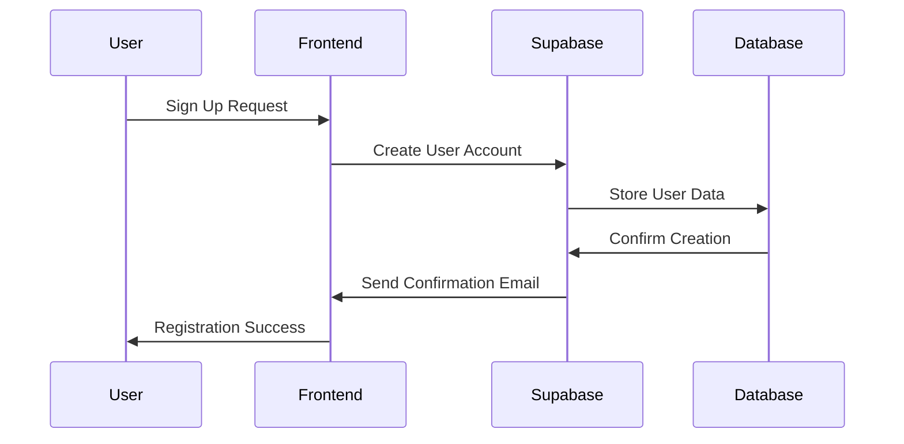

# Authentication

Configure user authentication and secure access to Polydev's features.

## Overview

Polydev supports multiple authentication methods to securely manage user access, API keys, and preferences. Authentication is required for the dashboard interface and optional for MCP-only setups.

## Authentication Methods

### 1. Supabase Auth (Primary)

Default authentication using Supabase's built-in auth system.

#### Setup Supabase Authentication

**1. Configure Supabase Project:**
```bash
# Create Supabase project at https://supabase.com
# Get credentials from Settings → API

# .env.local
NEXT_PUBLIC_SUPABASE_URL=https://your-project.supabase.co
NEXT_PUBLIC_SUPABASE_ANON_KEY=your-anon-key
SUPABASE_SERVICE_ROLE_KEY=your-service-role-key
```

**2. Configure Auth Providers:**

In your Supabase dashboard:
1. Go to **Authentication → Settings → Auth Providers**
2. Configure desired providers (email, Google, GitHub, etc.)

**3. Set Auth Callbacks:**
```bash
# Production
NEXT_PUBLIC_SITE_URL=https://your-domain.com

# Development  
NEXT_PUBLIC_SITE_URL=http://localhost:3000
```

#### Supported Auth Providers

**Email/Password:**
```typescript
// Email signup/login
const { data, error } = await supabase.auth.signUp({
  email: 'user@example.com',
  password: 'secure-password'
});
```

**OAuth Providers:**
- **Google**: Sign in with Google account
- **GitHub**: Sign in with GitHub account  
- **Discord**: Sign in with Discord account
- **Twitter**: Sign in with Twitter account

**Magic Links:**
```typescript
// Passwordless login
const { error } = await supabase.auth.signInWithOtp({
  email: 'user@example.com'
});
```

### 2. Custom Authentication

For enterprise or custom auth requirements.

#### JWT Authentication

```bash
# Custom JWT configuration
NEXTAUTH_SECRET=your-secret-key
NEXTAUTH_URL=https://your-domain.com  # or http://localhost:3000

# Custom auth provider
CUSTOM_AUTH_ENDPOINT=https://your-auth-server.com/api/auth
CUSTOM_AUTH_CLIENT_ID=your-client-id
CUSTOM_AUTH_CLIENT_SECRET=your-client-secret
```

#### Custom Auth Provider Example

```typescript
// lib/auth-config.ts
import { AuthOptions } from 'next-auth';
import { SupabaseAdapter } from '@auth/supabase-adapter';
import { createClient } from '@supabase/supabase-js';

const supabase = createClient(
  process.env.NEXT_PUBLIC_SUPABASE_URL!,
  process.env.SUPABASE_SERVICE_ROLE_KEY!
);

export const authOptions: AuthOptions = {
  adapter: SupabaseAdapter({
    url: process.env.NEXT_PUBLIC_SUPABASE_URL!,
    secret: process.env.SUPABASE_SERVICE_ROLE_KEY!,
  }),
  providers: [
    {
      id: "custom",
      name: "Custom Auth",
      type: "oauth",
      clientId: process.env.CUSTOM_AUTH_CLIENT_ID,
      clientSecret: process.env.CUSTOM_AUTH_CLIENT_SECRET,
      authorization: {
        url: "https://your-auth-server.com/oauth/authorize",
        params: {
          scope: "read:user user:email"
        }
      },
      token: "https://your-auth-server.com/oauth/token",
      userinfo: "https://your-auth-server.com/api/user"
    }
  ]
};
```

### 3. Token-Based Authentication (MCP Only)

For MCP server-only setups without the dashboard.

```bash
# Generate token in dashboard or set manually
POLYDEV_USER_TOKEN=poly_your_secure_token_here

# Token validation endpoint
POLYDEV_TOKEN_VALIDATION_URL=https://polydev.ai/api/auth/validate
```

## User Management

### User Registration Flow

**1. Registration Process:**


**2. User Profile Creation:**
```sql
-- Automatically created on first login
INSERT INTO user_profiles (
  id,
  email,
  created_at,
  plan,
  preferences
) VALUES (
  $1, -- user_id from auth
  $2, -- email
  NOW(),
  'free', -- default plan
  '{}'::jsonb -- default preferences
);
```

### User Roles and Permissions

```typescript
interface UserRole {
  id: string;
  name: 'admin' | 'user' | 'readonly';
  permissions: Permission[];
}

interface Permission {
  resource: 'api_keys' | 'models' | 'analytics' | 'settings';
  actions: ('create' | 'read' | 'update' | 'delete')[];
}

// Default role permissions
const defaultPermissions = {
  admin: ['*'], // All permissions
  user: [
    'api_keys:create,read,update,delete',
    'models:read',
    'analytics:read',
    'settings:create,read,update'
  ],
  readonly: [
    'models:read',
    'analytics:read'
  ]
};
```

## Security Configuration

### Password Requirements

```typescript
const passwordRequirements = {
  minLength: 12,
  requireUppercase: true,
  requireLowercase: true,
  requireNumbers: true,
  requireSpecialChars: true,
  preventCommonPasswords: true,
  preventUserDataInPassword: true
};
```

### Session Management

```bash
# Session configuration
SESSION_SECRET=your-session-secret
SESSION_TIMEOUT=86400000        # 24 hours in milliseconds
SESSION_EXTEND_ON_ACTIVITY=true # Extend session on activity
SESSION_SECURE=true             # Require HTTPS in production
```

### Multi-Factor Authentication (MFA)

**Enable MFA in Supabase:**
1. Go to **Authentication → Settings → Multi-Factor Authentication**
2. Enable TOTP (Time-based One-Time Password)
3. Configure backup codes

**MFA Configuration:**
```typescript
// Enable MFA for user
const { error } = await supabase.auth.mfa.enroll({
  factorType: 'totp',
  friendlyName: 'Polydev MFA'
});

// Verify MFA challenge
const { error } = await supabase.auth.mfa.challengeAndVerify({
  factorId: 'factor-id',
  code: '123456'
});
```

## API Key Protection

### Client-Side Encryption

API keys are encrypted in the browser before storage:

```typescript
class APIKeyManager {
  // Encrypt API key using user password
  async encryptKey(apiKey: string, userPassword: string): Promise<EncryptedKey> {
    const salt = crypto.getRandomValues(new Uint8Array(16));
    const keyMaterial = await crypto.subtle.importKey(
      'raw',
      new TextEncoder().encode(userPassword),
      'PBKDF2',
      false,
      ['deriveKey']
    );
    
    const derivedKey = await crypto.subtle.deriveKey(
      { 
        name: 'PBKDF2',
        salt,
        iterations: 100000,
        hash: 'SHA-256'
      },
      keyMaterial,
      { name: 'AES-GCM', length: 256 },
      false,
      ['encrypt']
    );
    
    const iv = crypto.getRandomValues(new Uint8Array(12));
    const encrypted = await crypto.subtle.encrypt(
      { name: 'AES-GCM', iv },
      derivedKey,
      new TextEncoder().encode(apiKey)
    );
    
    return {
      encrypted: Array.from(new Uint8Array(encrypted)),
      salt: Array.from(salt),
      iv: Array.from(iv)
    };
  }
  
  // Decrypt API key
  async decryptKey(
    encryptedKey: EncryptedKey,
    userPassword: string
  ): Promise<string> {
    const keyMaterial = await crypto.subtle.importKey(
      'raw',
      new TextEncoder().encode(userPassword),
      'PBKDF2',
      false,
      ['deriveKey']
    );
    
    const derivedKey = await crypto.subtle.deriveKey(
      {
        name: 'PBKDF2',
        salt: new Uint8Array(encryptedKey.salt),
        iterations: 100000,
        hash: 'SHA-256'
      },
      keyMaterial,
      { name: 'AES-GCM', length: 256 },
      false,
      ['decrypt']
    );
    
    const decrypted = await crypto.subtle.decrypt(
      {
        name: 'AES-GCM',
        iv: new Uint8Array(encryptedKey.iv)
      },
      derivedKey,
      new Uint8Array(encryptedKey.encrypted)
    );
    
    return new TextDecoder().decode(decrypted);
  }
}
```

### Server-Side Key Management

API keys are never stored in plaintext on the server:

```typescript
// Database storage (encrypted)
interface StoredAPIKey {
  id: string;
  user_id: string;
  provider: string;
  encrypted_key: string;    // Client-side encrypted
  key_hash: string;         // Server-side hash for validation
  created_at: string;
  last_used: string;
}

// Key validation without decryption
async function validateKeyHash(providedKey: string, storedHash: string): Promise<boolean> {
  const hash = await crypto.subtle.digest(
    'SHA-256',
    new TextEncoder().encode(providedKey + process.env.KEY_SALT)
  );
  
  return storedHash === Array.from(new Uint8Array(hash)).map(b => 
    b.toString(16).padStart(2, '0')
  ).join('');
}
```

## CORS and Security Headers

### CORS Configuration

```bash
# Allowed origins (comma-separated)
CORS_ORIGINS=https://your-domain.com,https://app.your-domain.com

# Allowed methods
CORS_METHODS=GET,POST,PUT,DELETE,OPTIONS

# Allowed headers
CORS_HEADERS=Content-Type,Authorization,X-Requested-With
```

### Security Headers

```typescript
// next.config.js security headers
const securityHeaders = [
  {
    key: 'X-DNS-Prefetch-Control',
    value: 'on'
  },
  {
    key: 'Strict-Transport-Security',
    value: 'max-age=63072000; includeSubDomains; preload'
  },
  {
    key: 'X-Frame-Options',
    value: 'DENY'
  },
  {
    key: 'X-Content-Type-Options',
    value: 'nosniff'
  },
  {
    key: 'Referrer-Policy',
    value: 'origin-when-cross-origin'
  },
  {
    key: 'Content-Security-Policy',
    value: [
      "default-src 'self'",
      "script-src 'self' 'unsafe-eval' 'unsafe-inline'",
      "style-src 'self' 'unsafe-inline'",
      "img-src 'self' data: https:",
      "connect-src 'self' https://api.openai.com https://api.anthropic.com",
    ].join('; ')
  }
];
```

## Rate Limiting and Abuse Prevention

### Authentication Rate Limiting

```typescript
interface AuthRateLimit {
  loginAttempts: {
    maxAttempts: 5;
    windowMs: 15 * 60 * 1000; // 15 minutes
    blockDurationMs: 60 * 60 * 1000; // 1 hour
  };
  
  passwordReset: {
    maxAttempts: 3;
    windowMs: 60 * 60 * 1000; // 1 hour
  };
  
  registration: {
    maxAttempts: 3;
    windowMs: 60 * 60 * 1000; // 1 hour
  };
}
```

### IP-Based Protection

```bash
# Rate limiting by IP
AUTH_RATE_LIMIT_BY_IP=true
AUTH_MAX_REQUESTS_PER_IP=100      # requests per hour
AUTH_BLOCK_DURATION=3600000       # 1 hour in milliseconds

# Suspicious activity detection
AUTH_DETECT_BRUTE_FORCE=true
AUTH_DETECT_CREDENTIAL_STUFFING=true
```

## Environment-Specific Auth Configuration

### Development Environment

```bash
# .env.local (development)
NEXT_PUBLIC_SUPABASE_URL=https://dev-project.supabase.co
NEXT_PUBLIC_SUPABASE_ANON_KEY=your-dev-anon-key
SUPABASE_SERVICE_ROLE_KEY=your-dev-service-key

# Relaxed security for development
AUTH_REQUIRE_EMAIL_VERIFICATION=false
AUTH_ALLOW_WEAK_PASSWORDS=true
SESSION_SECURE=false
```

### Production Environment

```bash
# .env.production
NEXT_PUBLIC_SUPABASE_URL=https://prod-project.supabase.co
NEXT_PUBLIC_SUPABASE_ANON_KEY=your-prod-anon-key
SUPABASE_SERVICE_ROLE_KEY=your-prod-service-key

# Strict security for production
AUTH_REQUIRE_EMAIL_VERIFICATION=true
AUTH_REQUIRE_MFA_FOR_ADMIN=true
AUTH_ENFORCE_STRONG_PASSWORDS=true
SESSION_SECURE=true
```

## Testing Authentication

### Unit Tests

```typescript
// Test authentication flow
describe('Authentication', () => {
  test('should authenticate user with valid credentials', async () => {
    const { data } = await supabase.auth.signInWithPassword({
      email: 'test@example.com',
      password: 'validpassword123'
    });
    
    expect(data.user).toBeDefined();
    expect(data.session).toBeDefined();
  });
  
  test('should reject invalid credentials', async () => {
    const { error } = await supabase.auth.signInWithPassword({
      email: 'test@example.com',
      password: 'wrongpassword'
    });
    
    expect(error).toBeDefined();
    expect(error?.message).toContain('Invalid credentials');
  });
});
```

### Integration Testing

```bash
# Test authentication endpoints
npm run test:auth

# Test MCP token validation
npm run test:mcp-auth

# Test rate limiting
npm run test:rate-limits
```

## Migration and Backup

### User Data Migration

```typescript
// Migrate users from v1 to v2 auth schema
async function migrateUsers() {
  const users = await supabase
    .from('legacy_users')
    .select('*');
    
  for (const user of users.data || []) {
    await supabase.auth.admin.createUser({
      email: user.email,
      password: generateTemporaryPassword(),
      email_confirm: true,
      user_metadata: {
        migrated_from: 'v1',
        legacy_id: user.id
      }
    });
  }
}
```

### Backup Auth Configuration

```bash
# Backup Supabase auth configuration
supabase db dump --schema auth > auth_backup.sql

# Backup custom auth settings
polydev auth export --format json > auth_config_backup.json
```

## Troubleshooting Authentication

### Common Issues

**Authentication not working:**
```bash
# Check Supabase connection
curl -H "apikey: $NEXT_PUBLIC_SUPABASE_ANON_KEY" \
     "$NEXT_PUBLIC_SUPABASE_URL/auth/v1/settings"

# Verify environment variables
npm run check:auth-config
```

**Session expiring too quickly:**
```bash
# Check session configuration
echo "Session timeout: $SESSION_TIMEOUT"

# Verify JWT secret
echo "JWT secret set: $([ -n "$NEXTAUTH_SECRET" ] && echo "yes" || echo "no")"
```

**MFA not working:**
```bash
# Test TOTP generation
npm run test:totp

# Check MFA configuration
supabase auth mfa list
```

### Debug Commands

```bash
# Enable auth debugging
DEBUG=auth* npm run dev

# Test auth flow
npm run debug:auth-flow

# Validate JWT tokens
npm run debug:jwt-validation
```

## Next Steps

Once authentication is configured:

1. **[Troubleshooting](troubleshooting.md)** - Resolve authentication issues
2. **[Provider Setup](../providers/)** - Configure AI providers with secure keys
3. **[User Preferences](preferences.md)** - Set up user-specific preferences
4. **[Analytics](../features/analytics.md)** - Track authenticated user activity

---

**Need help with authentication?** Check our [troubleshooting guide](troubleshooting.md) or join our [Discord](https://discord.gg/polydev).