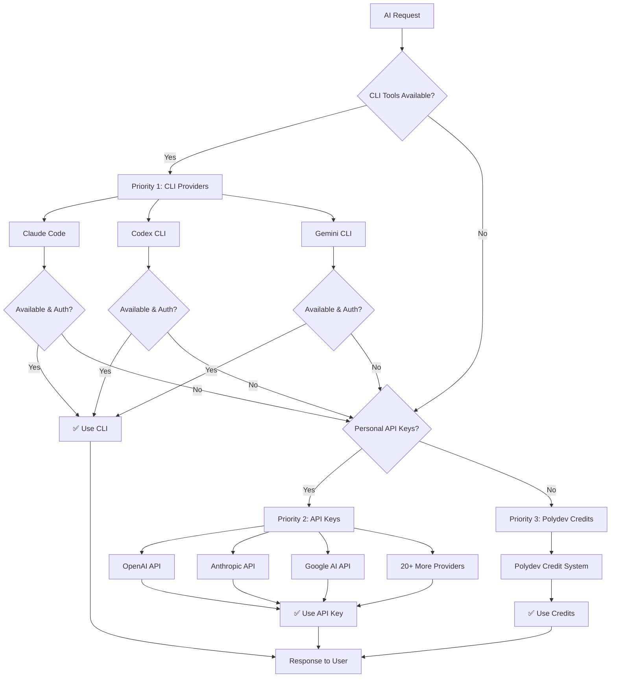

# Intelligent Fallback System

Polydev's smart provider routing ensures maximum availability and cost optimization through automatic fallback across CLI tools, personal API keys, and Polydev credits.

## Overview

The **Intelligent Fallback System** is Polydev's core routing mechanism that automatically selects the best available provider based on real-time availability, cost optimization, and performance requirements. This ensures your AI workflows never fail due to provider unavailability.



## Priority System

### 1. CLI Providers (Highest Priority)

**Benefits:**
- ✅ **No API Key Management** - Uses existing subscriptions
- ✅ **Highest Cost Efficiency** - Leverages paid subscriptions 
- ✅ **No Rate Limits** - Direct CLI access
- ✅ **Latest Models** - Access to newest model versions
- ✅ **Enhanced Privacy** - Local processing when possible

**Supported CLI Tools:**
- **[Claude Code](../../providers/cli-providers/claude-code.md)** - Anthropic's official CLI
- **[Codex CLI](../../providers/cli-providers/codex-cli.md)** - GitHub Copilot CLI access
- **[Gemini CLI](../../providers/cli-providers/gemini-cli.md)** - Google AI CLI tools

### 2. Personal API Keys (Medium Priority)

**Benefits:**
- ✅ **Direct Provider Access** - Your own rate limits and quotas
- ✅ **Full Control** - Choose specific models and parameters
- ✅ **Cost Transparency** - Direct billing from providers
- ✅ **High Availability** - Multiple providers as backup

**Supported Providers:**
- OpenAI (GPT-4, GPT-3.5, GPT-4-Turbo)
- Anthropic (Claude-3-Opus, Claude-3-Sonnet, Claude-3-Haiku)
- Google AI (Gemini-Pro, Gemini-Ultra, Gemini-Flash)
- [20+ Additional Providers](../../providers/api-providers/)

### 3. Polydev Credits (Fallback Priority)

**Benefits:**
- ✅ **Instant Access** - No setup required
- ✅ **Universal Compatibility** - Access to all models
- ✅ **Pay-as-you-go** - Only pay for what you use
- ✅ **Guaranteed Availability** - Always available as final fallback

## How Fallback Works

### Real-Time Detection

Polydev continuously monitors provider availability:

```javascript
// Real-time CLI detection example
const detectionResult = {
  "claude_code": {
    "available": true,
    "authenticated": true,
    "version": "1.2.3",
    "last_checked": "2024-01-15T10:30:00Z"
  },
  "codex_cli": {
    "available": false,
    "authenticated": false,
    "error": "Not installed",
    "last_checked": "2024-01-15T10:30:00Z"
  },
  "gemini_cli": {
    "available": true, 
    "authenticated": true,
    "version": "0.8.2",
    "last_checked": "2024-01-15T10:30:00Z"
  }
};
```

### Automatic Routing

```javascript
// Example fallback routing decision
const routingDecision = await polydev.perspectives({
  prompt: "Explain React hooks",
  models: ["claude-3-sonnet", "gpt-4"],
  // No provider specified - automatic fallback
});

// Polydev's internal routing logic:
// 1. Check Claude Code CLI for claude-3-sonnet ✅ Available
// 2. Check Codex CLI for gpt-4 ❌ Not available  
// 3. Check OpenAI API key for gpt-4 ✅ Available
// 4. Route: claude-3-sonnet → Claude Code CLI, gpt-4 → OpenAI API

console.log(routingDecision.routing_used);
// Output: 
// {
//   "claude-3-sonnet": {
//     "provider": "claude_code_cli",
//     "method": "cli",
//     "cost": 0,
//     "response_time": 1.8
//   },
//   "gpt-4": {
//     "provider": "openai_api",
//     "method": "api_key", 
//     "cost": 0.034,
//     "response_time": 2.1
//   }
// }
```

### Smart Model Mapping

Polydev automatically maps model requests to available providers:

```javascript
// Model mapping configuration
const modelMapping = {
  // Claude models
  "claude-3-opus": {
    cli: ["claude_code"],
    api: ["anthropic"],
    credits: ["polydev_anthropic"]
  },
  "claude-3-sonnet": {
    cli: ["claude_code"],
    api: ["anthropic"],
    credits: ["polydev_anthropic"]
  },
  
  // OpenAI models
  "gpt-4": {
    cli: ["codex_cli"],  // If available
    api: ["openai"],
    credits: ["polydev_openai"]
  },
  "gpt-3.5-turbo": {
    cli: [],
    api: ["openai"],
    credits: ["polydev_openai"]
  },
  
  // Google models
  "gemini-pro": {
    cli: ["gemini_cli"],
    api: ["google_ai"],
    credits: ["polydev_google"]
  }
};
```

## Configuration Options

### Fallback Preferences

```javascript
// polydev.config.js
export default {
  fallback: {
    // Provider priority order
    priority: ["cli", "api_keys", "credits"],
    
    // CLI provider preferences
    cli_providers: {
      enabled: true,
      detection_interval: 30000,  // 30 seconds
      preferred_order: ["claude_code", "codex_cli", "gemini_cli"],
      timeout: 45000  // 45 seconds per CLI request
    },
    
    // API key preferences
    api_providers: {
      enabled: true,
      preferred_providers: ["openai", "anthropic", "google_ai"],
      rate_limit_buffer: 0.8,  // Use 80% of rate limit
      retry_attempts: 3
    },
    
    // Credit system preferences
    credit_system: {
      enabled: true,
      max_daily_spend: 50.00,  // $50 daily limit
      alert_threshold: 40.00,  // Alert at $40
      auto_topup: false
    }
  }
};
```

### Model-Specific Routing

```javascript
// Customize routing per model
const customRouting = await polydev.perspectives({
  prompt: "Code review task",
  models: [
    {
      model: "claude-3-opus",
      preferred_providers: ["claude_code", "anthropic"],  // Skip credits
      max_cost: 0.10
    },
    {
      model: "gpt-4",
      preferred_providers: ["openai"],  // API key only
      fallback_allowed: false  // Don't use credits
    }
  ]
});
```

### Advanced Fallback Rules

```javascript
// Complex fallback configuration
export default {
  fallback: {
    rules: [
      {
        condition: "task_type === 'code_review'",
        preferred_providers: ["claude_code", "codex_cli"],
        avoid_providers: ["credits"]
      },
      {
        condition: "estimated_cost > 1.00",
        required_confirmation: true,
        max_credit_usage: 0.50
      },
      {
        condition: "peak_hours && cli_available",
        boost_cli_priority: true,
        reduce_api_usage: true
      }
    ]
  }
};
```

## Monitoring and Analytics

### Real-Time Status Dashboard

```javascript
// Get current provider status
const providerStatus = await polydev.getProviderStatus();

console.log(providerStatus);
// Output:
// {
//   "cli_providers": {
//     "claude_code": {
//       "status": "available",
//       "health_score": 0.98,
//       "avg_response_time": 1.8,
//       "success_rate": 0.97,
//       "last_used": "2024-01-15T10:25:00Z"
//     },
//     "codex_cli": {
//       "status": "unavailable",
//       "error": "Authentication expired",
//       "last_attempt": "2024-01-15T09:45:00Z"
//     }
//   },
//   "api_providers": {
//     "openai": {
//       "status": "available",
//       "rate_limit_remaining": 180,
//       "quota_used": 0.45,
//       "avg_response_time": 2.1
//     }
//   }
// }
```

### Fallback Analytics

```javascript
// Get fallback usage statistics
const fallbackStats = await polydev.getAnalytics({
  timeframe: "last_7_days",
  breakdown: "by_provider"
});

console.log(fallbackStats);
// Output:
// {
//   "total_requests": 1247,
//   "routing_breakdown": {
//     "cli_success": 758,      // 60.8%
//     "api_key_usage": 423,    // 33.9%
//     "credit_fallback": 66    // 5.3%
//   },
//   "cost_analysis": {
//     "total_cost": 23.45,
//     "cli_cost": 0.00,        // No additional cost
//     "api_cost": 18.23,       // Personal API usage
//     "credit_cost": 5.22      // Polydev credits
//   },
//   "performance_metrics": {
//     "avg_response_time": 2.1,
//     "success_rate": 0.962,
//     "error_rate": 0.038
//   }
// }
```

## Error Handling and Recovery

### Graceful Degradation

```javascript
try {
  const response = await polydev.perspectives({
    prompt: "Complex analysis task",
    models: ["claude-3-opus", "gpt-4-turbo"],
    
    fallback_options: {
      degradation_strategy: "graceful",
      min_successful_models: 1,
      allow_simpler_models: true,
      max_fallback_attempts: 3
    }
  });
  
} catch (error) {
  if (error.code === "ALL_PROVIDERS_FAILED") {
    // All fallback options exhausted
    console.error("No providers available:", error.details);
    
    // Manual provider override
    const emergencyResponse = await polydev.perspectives({
      prompt: "Complex analysis task",
      provider_override: "polydev_credits",
      simplified_analysis: true
    });
  }
}
```

### Provider Health Monitoring

```javascript
// Set up automatic health monitoring
const healthMonitor = polydev.createHealthMonitor({
  check_interval: 60000,  // Check every minute
  
  alerts: {
    cli_provider_down: {
      enabled: true,
      notification: "email",
      threshold: "any_cli_unavailable"
    },
    high_api_usage: {
      enabled: true,
      notification: "dashboard", 
      threshold: 0.8  // 80% of quota
    },
    cost_threshold: {
      enabled: true,
      notification: "email",
      threshold: 40.00  // $40 daily spending
    }
  },
  
  auto_recovery: {
    retry_failed_cli: true,
    clear_api_rate_limits: true,
    rebalance_load: true
  }
});

// Monitor events
healthMonitor.on('provider_recovered', (provider) => {
  console.log(`Provider ${provider} is back online`);
});

healthMonitor.on('fallback_triggered', (details) => {
  console.log(`Fallback triggered: ${details.from} → ${details.to}`);
});
```

## Performance Optimization

### Intelligent Caching

```javascript
// Cache CLI detection results
const optimizedFallback = {
  cli_detection: {
    cache_ttl: 300000,     // 5 minutes
    background_refresh: true,
    predictive_detection: true
  },
  
  api_health_checks: {
    cache_ttl: 60000,      // 1 minute  
    parallel_checks: true,
    circuit_breaker: true
  },
  
  routing_cache: {
    cache_ttl: 30000,      // 30 seconds
    invalidate_on_error: true,
    per_user_cache: true
  }
};
```

### Load Balancing

```javascript
// Distribute load across providers
const loadBalancedRequest = await polydev.perspectives({
  prompt: "Multiple similar requests",
  models: ["claude-3-sonnet", "gpt-4"],
  
  load_balancing: {
    strategy: "round_robin",    // or "least_loaded", "random"
    sticky_sessions: false,
    health_weights: true,
    avoid_overloaded: true
  }
});
```

## CLI Provider Integration

### Automatic Detection Setup

```bash
# Enable automatic CLI detection
export POLYDEV_CLI_AUTO_DETECT=true
export POLYDEV_CLI_DETECTION_INTERVAL=30000

# Start Polydev with CLI monitoring
npm run start:with-cli-monitoring
```

### Manual CLI Registration

```javascript
// Register custom CLI provider
await polydev.registerCLIProvider({
  id: "custom_cli",
  name: "Custom AI CLI",
  detection_command: "custom-ai --version",
  execution_command: "custom-ai query",
  models: ["custom-model-1", "custom-model-2"],
  
  authentication_check: async () => {
    // Custom auth validation
    const result = await exec("custom-ai auth status");
    return result.includes("authenticated");
  },
  
  request_handler: async (prompt, model, options) => {
    // Custom request handling
    const response = await exec(`custom-ai query "${prompt}" --model ${model}`);
    return { content: response, tokens: response.length };
  }
});
```

## API Provider Integration

### Multi-Provider API Setup

```javascript
// Configure multiple API providers
const apiConfig = {
  providers: {
    openai: {
      api_key: process.env.OPENAI_API_KEY,
      models: ["gpt-4", "gpt-3.5-turbo", "gpt-4-turbo"],
      rate_limits: {
        requests_per_minute: 60,
        tokens_per_minute: 150000
      }
    },
    
    anthropic: {
      api_key: process.env.ANTHROPIC_API_KEY,
      models: ["claude-3-opus", "claude-3-sonnet", "claude-3-haiku"],
      rate_limits: {
        requests_per_minute: 50,
        tokens_per_minute: 100000
      }
    },
    
    google_ai: {
      api_key: process.env.GOOGLE_AI_API_KEY,
      models: ["gemini-pro", "gemini-ultra", "gemini-flash"],
      rate_limits: {
        requests_per_minute: 100,
        tokens_per_minute: 200000
      }
    }
  }
};
```

### Dynamic API Key Management

```javascript
// Rotate API keys based on usage
const keyManager = polydev.createAPIKeyManager({
  rotation_strategy: "usage_based",
  keys: {
    openai: [
      { key: "sk-key1", priority: 1, quota_limit: 1000000 },
      { key: "sk-key2", priority: 2, quota_limit: 500000 },
      { key: "sk-key3", priority: 3, quota_limit: 250000 }
    ]
  },
  
  rotation_triggers: {
    quota_threshold: 0.9,      // Rotate at 90% quota
    rate_limit_hit: true,      // Rotate on rate limits
    error_threshold: 0.1       // Rotate after 10% error rate
  }
});
```

## Best Practices

### Cost Optimization

**✅ Maximize CLI Usage:**

```javascript
// Prioritize CLI tools for cost savings
const costOptimized = await polydev.perspectives({
  prompt: "Regular analysis task",
  models: ["claude-3-sonnet", "gpt-4"],
  
  cost_optimization: {
    prefer_cli: true,
    max_api_cost: 0.50,        // $0.50 limit for API usage
    credit_cost_limit: 0.25,   // $0.25 limit for credits
    cost_alert_threshold: 0.75  // Alert at 75% of limits
  }
});
```

**✅ Smart Model Selection:**

```javascript
// Choose appropriate model complexity for the task
const taskBasedModels = {
  simple_tasks: ["gpt-3.5-turbo", "claude-3-haiku"],
  complex_tasks: ["gpt-4", "claude-3-opus"],
  code_tasks: ["codex", "claude-3-sonnet"]
};
```

### Reliability Optimization

**✅ Multiple Fallback Layers:**

```javascript
// Configure comprehensive fallback
const reliableSetup = {
  fallback: {
    cli_providers: ["claude_code", "codex_cli", "gemini_cli"],
    api_providers: ["openai", "anthropic", "google_ai", "cohere"],
    credits: {
      enabled: true,
      emergency_reserve: 10.00  // $10 emergency reserve
    }
  }
};
```

### Performance Optimization

**✅ Parallel Provider Checks:**

```javascript
// Enable parallel health monitoring
const performanceConfig = {
  monitoring: {
    parallel_health_checks: true,
    concurrent_provider_tests: 3,
    background_status_updates: true,
    predictive_provider_scoring: true
  }
};
```

## Troubleshooting

### Common Fallback Issues

**CLI Providers Not Detected:**

```bash
# Test CLI detection manually
npm run test:cli-detection

# Enable verbose CLI debugging
export POLYDEV_CLI_DEBUG=1
export POLYDEV_CLI_VERBOSE=1

# Check PATH and permissions
which claude
which codex
which gcloud
```

**API Rate Limits:**

```javascript
// Configure rate limit handling
const rateLimitConfig = {
  api_providers: {
    rate_limit_strategy: "exponential_backoff",
    backoff_multiplier: 2,
    max_retry_delay: 60000,
    retry_attempts: 5
  }
};
```

**Fallback Loops:**

```javascript
// Prevent infinite fallback attempts
const safeConfig = {
  fallback: {
    max_attempts: 3,
    cooldown_period: 30000,
    circuit_breaker: true,
    fallback_timeout: 120000
  }
};
```

### Debug Mode

```javascript
// Enable comprehensive fallback debugging
const debugResponse = await polydev.perspectives({
  prompt: "Debug test",
  models: ["claude-3-sonnet"],
  
  debug: {
    trace_fallback_decisions: true,
    log_provider_attempts: true,
    include_timing_data: true,
    verbose_error_messages: true
  }
});

console.log(debugResponse.debug_info);
// Shows complete fallback decision tree
```

## Integration Examples

### React Application

```typescript
import { usePolydevFallback } from '@polydev/react';

function AIChat() {
  const { 
    sendMessage, 
    providerStatus, 
    fallbackHistory,
    costSummary 
  } = usePolydevFallback({
    preferred_providers: ['claude_code', 'openai'],
    cost_limits: { daily: 10.00 },
    fallback_enabled: true
  });

  return (
    <div>
      <ProviderStatusIndicator status={providerStatus} />
      <CostTracker summary={costSummary} />
      <ChatInterface onSend={sendMessage} />
      <FallbackHistory history={fallbackHistory} />
    </div>
  );
}
```

### Node.js Backend

```javascript
const express = require('express');
const { PolydevClient } = require('@polydev/node');

const app = express();
const polydev = new PolydevClient({
  fallback: {
    priority: ['cli', 'api_keys', 'credits'],
    cost_limits: { request: 1.00, daily: 50.00 },
    monitoring: { enabled: true, alerts: true }
  }
});

app.post('/ai/analyze', async (req, res) => {
  try {
    const result = await polydev.perspectives({
      prompt: req.body.prompt,
      models: req.body.models || ['claude-3-sonnet', 'gpt-4'],
      fallback_metadata: {
        user_id: req.user.id,
        request_type: 'analysis'
      }
    });
    
    res.json({
      perspectives: result.perspectives,
      routing_used: result.routing_info,
      cost_breakdown: result.cost_summary
    });
    
  } catch (error) {
    res.status(500).json({ 
      error: error.message,
      fallback_attempts: error.fallback_attempts,
      available_providers: error.available_providers
    });
  }
});
```

## Next Steps

- **[Project Memory](../memory/)** - Add intelligent context selection
- **[Analytics](../analytics/)** - Monitor fallback performance
- **[CLI Providers](../../providers/cli-providers/)** - Set up CLI tools
- **[API Providers](../../providers/api-providers/)** - Configure API keys

---

**Need help configuring fallback?** Check the [troubleshooting guide](../../config/troubleshooting.md) or join our [Discord](https://discord.gg/polydev).