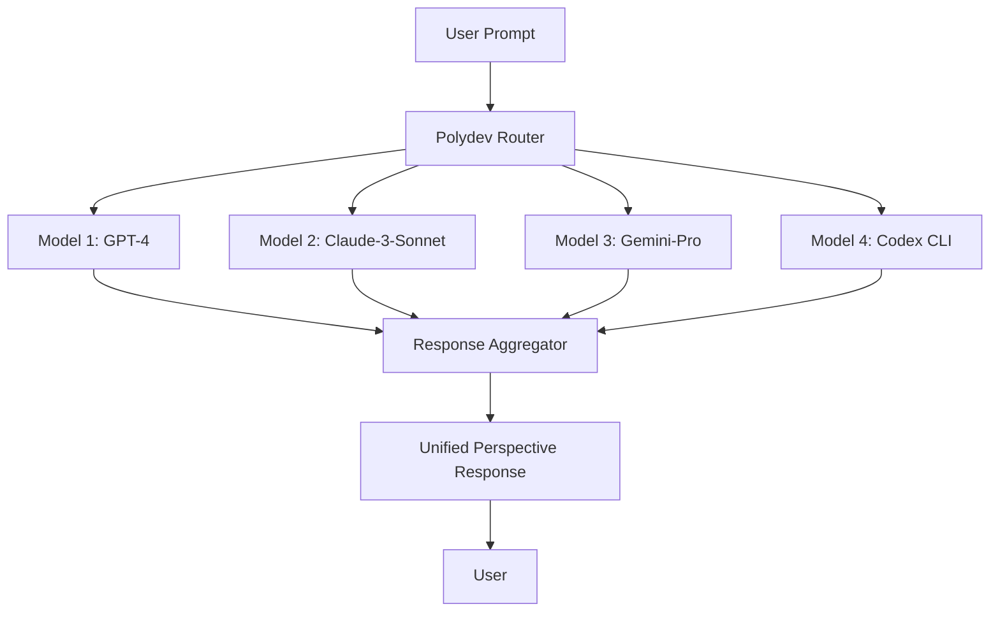

# Multi-LLM Perspectives

Get diverse AI perspectives from multiple models simultaneously for better decision-making and comprehensive analysis.

## Overview

Polydev's **Multi-LLM Perspectives** feature allows you to query multiple AI models concurrently, aggregate their responses, and gain diverse insights for complex tasks. This is particularly valuable for code reviews, architecture decisions, and any scenario where multiple expert opinions enhance the quality of the outcome.



## Key Benefits

### 🎯 **Enhanced Accuracy**
- **Cross-validation**: Multiple models validate each other's outputs
- **Error Reduction**: Individual model mistakes get filtered out
- **Consensus Building**: Common themes across models indicate reliability

### 🔍 **Diverse Viewpoints** 
- **Different Strengths**: Each model brings unique capabilities
- **Comprehensive Analysis**: Multiple angles on complex problems
- **Bias Mitigation**: Reduces single-model biases and limitations

### ⚡ **Parallel Processing**
- **Concurrent Execution**: All models queried simultaneously
- **Optimized Performance**: No sequential delays between model calls
- **Intelligent Fallback**: Automatic handling of unavailable models

### 💡 **Better Decision Making**
- **Informed Choices**: More data points for critical decisions
- **Risk Assessment**: Multiple perspectives on potential issues
- **Quality Assurance**: Enhanced confidence in AI-generated solutions

## Usage Patterns

### Basic Multi-Model Query

```javascript
const response = await perspectives({
  prompt: "Review this React component for performance issues and suggest optimizations",
  models: ["gpt-4", "claude-3-sonnet", "gemini-pro"],
  context: {
    code: `
      const Component = () => {
        const [data, setData] = useState([]);
        const expensiveComputation = () => {
          return data.map(item => item.value * 2);
        };
        return <div>{expensiveComputation().join(', ')}</div>;
      };
    `
  }
});

// Response contains perspectives from all 3 models
console.log(response.perspectives);
```

### Code Review with Multiple Experts

```javascript
// Get comprehensive code review from multiple AI experts
const codeReview = await perspectives({
  prompt: `
    Please review this authentication module for:
    1. Security vulnerabilities
    2. Performance optimizations
    3. Code maintainability
    4. Best practices compliance
  `,
  models: ["claude-3-opus", "gpt-4-turbo", "codex"],
  project_memory: "smart",
  provider_settings: {
    temperature: 0.1,  // More focused responses
    max_tokens: 2000
  }
});

// Each perspective is labeled by model
codeReview.perspectives.forEach(perspective => {
  console.log(`--- ${perspective.model} ---`);
  console.log(perspective.content);
});
```

### Architecture Decision Support

```javascript
// Get diverse opinions on technical architecture choices
const architectureAdvice = await perspectives({
  prompt: `
    We're building a real-time chat application with 100K+ concurrent users.
    
    Should we use:
    A) WebSockets with Redis pub/sub
    B) Server-Sent Events with PostgreSQL
    C) GraphQL subscriptions with in-memory store
    
    Consider scalability, reliability, and development complexity.
  `,
  models: ["claude-3-sonnet", "gpt-4", "gemini-pro", "perplexity"],
  analysis_depth: "comprehensive"
});

// Analyze consensus and differences
const consensus = analyzeConsensus(architectureAdvice.perspectives);
console.log("Consensus points:", consensus.agreements);
console.log("Divergent opinions:", consensus.disagreements);
```

## Model Selection Strategies

### Task-Specific Model Selection

Different models excel at different types of tasks:

```javascript
// Code-focused perspectives
const codeReview = await perspectives({
  prompt: "Optimize this algorithm for better performance",
  models: ["codex", "claude-3-sonnet", "gpt-4"],  // Code-specialized models
  task_type: "code_optimization"
});

// Creative/Writing perspectives  
const contentReview = await perspectives({
  prompt: "Improve this marketing copy for better engagement",
  models: ["gpt-4-turbo", "claude-3-opus", "gemini-pro"],  // Creative models
  task_type: "creative_writing"
});

// Technical Analysis perspectives
const systemDesign = await perspectives({
  prompt: "Design a microservices architecture for an e-commerce platform",
  models: ["claude-3-opus", "gpt-4", "perplexity"],  // Analysis-focused models
  task_type: "system_design"
});
```

### Performance vs Quality Balance

```javascript
// Fast perspectives for quick decisions
const quickConsensus = await perspectives({
  prompt: "Is this function implementation correct?",
  models: ["gpt-3.5-turbo", "claude-3-haiku", "gemini-flash"],
  priority: "speed"
});

// High-quality perspectives for critical decisions
const thoroughAnalysis = await perspectives({
  prompt: "Comprehensive security audit of this authentication system",
  models: ["claude-3-opus", "gpt-4-turbo", "gemini-ultra"],
  priority: "quality",
  analysis_depth: "comprehensive"
});
```

## Response Aggregation

### Structured Response Format

```javascript
{
  "request_id": "req_abc123",
  "timestamp": "2024-01-15T10:30:00Z",
  "models_queried": ["gpt-4", "claude-3-sonnet", "gemini-pro"],
  "models_succeeded": ["gpt-4", "claude-3-sonnet", "gemini-pro"],
  "models_failed": [],
  "perspectives": [
    {
      "model": "gpt-4",
      "provider": "openai",
      "response_time": 2340,
      "tokens_used": 456,
      "confidence_score": 0.92,
      "content": "This React component has several performance issues..."
    },
    {
      "model": "claude-3-sonnet", 
      "provider": "anthropic",
      "response_time": 1890,
      "tokens_used": 523,
      "confidence_score": 0.87,
      "content": "I notice multiple optimization opportunities in this component..."
    },
    {
      "model": "gemini-pro",
      "provider": "google",
      "response_time": 2100,
      "tokens_used": 478,
      "confidence_score": 0.89,
      "content": "The component could be optimized by addressing these areas..."
    }
  ],
  "summary": {
    "consensus_points": [
      "useMemo needed for expensive computation",
      "useCallback recommended for event handlers",
      "Key prop missing in list rendering"
    ],
    "divergent_opinions": [
      "GPT-4 suggests React.memo, Claude suggests component splitting"
    ],
    "confidence_average": 0.89,
    "total_tokens": 1457,
    "total_cost": 0.0234
  }
}
```

### Consensus Analysis

```javascript
// Automatic consensus detection
const analysis = await perspectives({
  prompt: "What are the pros and cons of using TypeScript in this project?",
  models: ["gpt-4", "claude-3-sonnet", "gemini-pro"],
  consensus_analysis: true
});

console.log("Strong consensus on:", analysis.summary.consensus_points);
console.log("Models disagree on:", analysis.summary.divergent_opinions);
console.log("Overall confidence:", analysis.summary.confidence_average);
```

## Advanced Features

### Intelligent Model Routing

Polydev automatically selects the best models for your specific task:

```javascript
// Auto-select models based on prompt analysis
const smartPerspectives = await perspectives({
  prompt: "Debug this complex SQL query performance issue",
  auto_select_models: true,
  model_count: 3,  // Request 3 best models for this task
  task_context: {
    domain: "database",
    complexity: "high",
    urgency: "medium"
  }
});

// Polydev might select: ["claude-3-opus", "gpt-4-turbo", "specialized-sql-model"]
```

### Perspective Weighting

Weight different models based on their expertise:

```javascript
const weightedPerspectives = await perspectives({
  prompt: "Review this machine learning model architecture",
  models: [
    { model: "claude-3-opus", weight: 0.4 },      // Strong at analysis
    { model: "gpt-4-turbo", weight: 0.4 },       // Strong at ML
    { model: "perplexity", weight: 0.2 }         // Good at research
  ],
  weighted_consensus: true
});
```

### Context-Aware Perspectives

Leverage project memory for better context:

```javascript
const contextualPerspectives = await perspectives({
  prompt: "How should we refactor the user authentication system?",
  models: ["claude-3-sonnet", "gpt-4", "codex"],
  project_memory: "full",
  context_selection: {
    include_files: ["**/*auth*", "**/*user*", "**/*login*"],
    similarity_threshold: 0.7,
    max_context_size: 50000
  }
});
```

## Integration Examples

### React Hook Integration

```typescript
import { usePerspectives } from '@polydev/react';

function CodeReviewer({ code }: { code: string }) {
  const { 
    perspectives, 
    loading, 
    error, 
    consensus 
  } = usePerspectives({
    prompt: `Review this code: ${code}`,
    models: ['gpt-4', 'claude-3-sonnet', 'codex'],
    auto_refresh: false
  });

  if (loading) return <LoadingSpinner />;
  if (error) return <ErrorMessage error={error} />;

  return (
    <div className="perspectives-view">
      <ConsensusPanel consensus={consensus} />
      
      {perspectives.map((perspective, index) => (
        <PerspectiveCard 
          key={index}
          model={perspective.model}
          content={perspective.content}
          confidence={perspective.confidence_score}
        />
      ))}
    </div>
  );
}
```

### VS Code Extension

```typescript
// VS Code extension integration
import * as vscode from 'vscode';
import { PolydevMCP } from '@polydev/mcp-client';

export function activate(context: vscode.ExtensionContext) {
  const mcpClient = new PolydevMCP({
    serverPath: context.asAbsolutePath('mcp-server.js')
  });

  const reviewCommand = vscode.commands.registerCommand(
    'polydev.reviewCode',
    async () => {
      const editor = vscode.window.activeTextEditor;
      if (!editor) return;

      const code = editor.document.getText(editor.selection);
      
      const perspectives = await mcpClient.callTool({
        name: 'get_perspectives',
        arguments: {
          prompt: `Review this code for issues and improvements:\n\n${code}`,
          models: ['claude-3-sonnet', 'gpt-4', 'codex'],
          project_context: {
            workspace_root: vscode.workspace.rootPath
          }
        }
      });

      // Display perspectives in side panel
      showPerspectivesPanel(perspectives);
    }
  );

  context.subscriptions.push(reviewCommand);
}
```

### CLI Tool Integration

```bash
#!/bin/bash
# polydev-review.sh - Command-line code review tool

code_file="$1"
if [ -z "$code_file" ]; then
  echo "Usage: $0 <file_to_review>"
  exit 1
fi

# Read code file
code_content=$(cat "$code_file")

# Get perspectives via Polydev API
curl -X POST https://api.polydev.ai/v1/perspectives \
  -H "Authorization: Bearer $POLYDEV_API_KEY" \
  -H "Content-Type: application/json" \
  -d '{
    "prompt": "Review this code for security, performance, and maintainability issues:",
    "context": "'"$code_content"'",
    "models": ["claude-3-sonnet", "gpt-4-turbo", "codex"],
    "format": "structured"
  }' | jq '.perspectives[] | "\(.model): \(.content)"'
```

## Configuration Options

### Model Configuration

```javascript
// polydev.config.js
export default {
  perspectives: {
    default_models: ["claude-3-sonnet", "gpt-4", "gemini-pro"],
    fallback_models: ["gpt-3.5-turbo", "claude-3-haiku"],
    
    model_preferences: {
      code_tasks: ["codex", "claude-3-sonnet", "gpt-4"],
      creative_tasks: ["gpt-4-turbo", "claude-3-opus"],
      analysis_tasks: ["claude-3-opus", "gpt-4", "perplexity"]
    },
    
    performance_settings: {
      max_concurrent_requests: 5,
      timeout_per_model: 30000,
      retry_attempts: 2
    },
    
    quality_settings: {
      min_confidence_threshold: 0.7,
      consensus_threshold: 0.8,
      auto_filter_low_quality: true
    }
  }
};
```

### Response Processing

```javascript
// Custom response processing
const perspectives = await polydev.perspectives({
  prompt: "Analyze this architecture design",
  models: ["claude-3-opus", "gpt-4-turbo"],
  
  response_processing: {
    extract_code_blocks: true,
    highlight_differences: true,
    generate_summary: true,
    
    custom_filters: [
      (response) => response.confidence_score > 0.8,
      (response) => response.content.length > 100
    ]
  }
});
```

## Performance Optimization

### Caching Strategies

```javascript
// Enable response caching for similar prompts
const perspectives = await polydev.perspectives({
  prompt: "Best practices for React performance optimization",
  models: ["gpt-4", "claude-3-sonnet"],
  
  caching: {
    enabled: true,
    ttl: 3600000,  // 1 hour
    cache_key_strategy: "semantic_similarity",
    similarity_threshold: 0.9
  }
});
```

### Batching Requests

```javascript
// Batch multiple perspective requests
const batchResults = await polydev.batchPerspectives([
  {
    id: "review1",
    prompt: "Review component A",
    models: ["gpt-4", "claude-3-sonnet"]
  },
  {
    id: "review2", 
    prompt: "Review component B",
    models: ["gpt-4", "claude-3-sonnet"]
  }
]);

// Process results
batchResults.forEach(result => {
  console.log(`${result.id}: ${result.perspectives.length} perspectives`);
});
```

## Error Handling

### Graceful Degradation

```javascript
try {
  const perspectives = await polydev.perspectives({
    prompt: "Complex analysis task",
    models: ["claude-3-opus", "gpt-4-turbo", "unavailable-model"],
    
    error_handling: {
      min_successful_models: 2,
      fallback_on_failure: true,
      partial_success_acceptable: true
    }
  });
  
  // Handle partial results
  if (perspectives.models_failed.length > 0) {
    console.warn(`Failed models: ${perspectives.models_failed.join(', ')}`);
  }
  
} catch (error) {
  if (error.code === 'INSUFFICIENT_MODELS') {
    // Handle case where not enough models succeeded
    const fallbackResponse = await polydev.perspectives({
      prompt: "Complex analysis task", 
      models: ["gpt-3.5-turbo"],  // Use simpler fallback
      simplified: true
    });
  }
}
```

## Best Practices

### Prompt Engineering for Multiple Models

**✅ Good - Clear, specific prompts work well across models:**

```javascript
const perspectives = await polydev.perspectives({
  prompt: `
    Please analyze this React component and provide:
    
    1. Performance optimization opportunities
    2. Potential bugs or issues  
    3. Code maintainability improvements
    4. Best practices recommendations
    
    Component code:
    ${componentCode}
  `,
  models: ["claude-3-sonnet", "gpt-4", "codex"]
});
```

**❌ Avoid - Model-specific prompts that don't translate well:**

```javascript
// Don't use prompts tailored to specific models
const perspectives = await polydev.perspectives({
  prompt: "As GPT-4, analyze this code...",  // ❌ Model-specific
  models: ["claude-3-sonnet", "gpt-4", "gemini-pro"]
});
```

### Model Selection Guidelines

1. **Code Tasks**: Include Codex, Claude-3-Sonnet, GPT-4
2. **Creative Tasks**: GPT-4-Turbo, Claude-3-Opus, Gemini-Pro  
3. **Analysis Tasks**: Claude-3-Opus, GPT-4, Perplexity
4. **Quick Tasks**: GPT-3.5-Turbo, Claude-3-Haiku, Gemini-Flash

### Cost Optimization

```javascript
// Use cost-effective models for preliminary analysis
const quickScreen = await perspectives({
  prompt: "Initial code review - major issues only",
  models: ["gpt-3.5-turbo", "claude-3-haiku"],
  format: "brief"
});

// Use premium models for detailed analysis of flagged issues
if (quickScreen.summary.issues_found > 0) {
  const detailedAnalysis = await perspectives({
    prompt: "Detailed analysis of identified issues",
    models: ["claude-3-opus", "gpt-4-turbo"],
    context: quickScreen.summary.issues
  });
}
```

## Troubleshooting

### Common Issues

**Models Not Responding:**

```javascript
// Enable debug mode to see detailed logs
const perspectives = await polydev.perspectives({
  prompt: "Test prompt",
  models: ["claude-3-sonnet", "gpt-4"],
  debug: true,
  verbose_errors: true
});
```

**Inconsistent Results:**

```javascript
// Increase model count for more stable consensus
const perspectives = await polydev.perspectives({
  prompt: "Analyze this complex algorithm",
  models: ["claude-3-opus", "gpt-4-turbo", "gemini-pro", "perplexity"],
  consensus_analysis: true,
  min_agreement_threshold: 0.7
});
```

**Performance Issues:**

```javascript
// Optimize for speed
const fastPerspectives = await polydev.perspectives({
  prompt: "Quick code review",
  models: ["gpt-3.5-turbo", "claude-3-haiku"],
  
  performance_mode: "speed",
  max_response_length: 1000,
  temperature: 0.3  // More focused responses
});
```

## Next Steps

- **[Fallback System](../fallback/)** - Understand provider routing
- **[Project Memory](../memory/)** - Add intelligent context
- **[Analytics](../analytics/)** - Monitor perspective quality
- **[API Reference](../../api/perspectives.md)** - Complete API documentation

---

**Ready to implement multi-LLM perspectives?** Start with the [Quick Start Guide](../../intro/quick-start.md) or explore the [API Reference](../../api/perspectives.md).