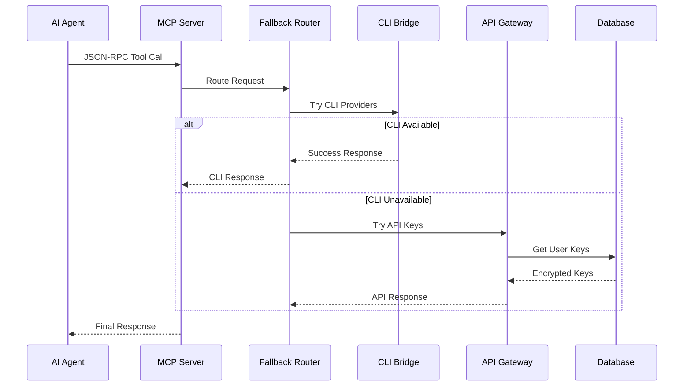
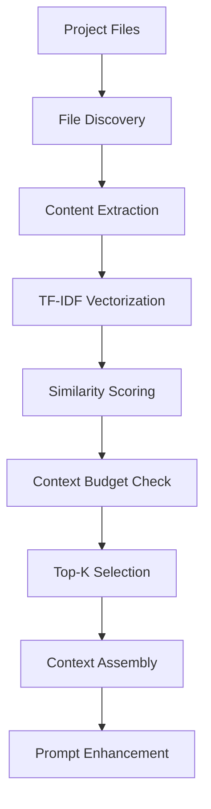

# Polydev Architecture

Understanding Polydev's architecture will help you make the most of its capabilities and troubleshoot issues effectively.

## High-Level Architecture

```
┌─────────────────────────────────────────────────────────────────┐
│                        MCP Clients                              │
│         (Claude Desktop, Cline, Custom Agents)                 │
└───────────────────────┬─────────────────────────────────────────┘
                        │ JSON-RPC over stdio/HTTP
                        ▼
┌─────────────────────────────────────────────────────────────────┐
│                   Polydev MCP Server                           │
│                                                                 │
│  ┌─────────────────┐  ┌─────────────────┐  ┌─────────────────┐ │
│  │   CLI Bridge    │  │  API Gateway    │  │ Context Engine  │ │
│  │                 │  │                 │  │                 │ │
│  │ • Claude Code   │  │ • 20+ Providers │  │ • Project Memory│ │
│  │ • Codex CLI     │  │ • Rate Limiting │  │ • TF-IDF Search │ │
│  │ • Gemini CLI    │  │ • Key Management│  │ • Smart Caching │ │
│  └─────────────────┘  └─────────────────┘  └─────────────────┘ │
│                                                                 │
│  ┌─────────────────┐  ┌─────────────────┐  ┌─────────────────┐ │
│  │ Fallback Router │  │  Response Agg   │  │   Analytics     │ │
│  │                 │  │                 │  │                 │ │
│  │ Priority-based  │  │ • Multi-model   │  │ • Usage Tracking│ │
│  │ Request Routing │  │ • Perspective   │  │ • Performance   │ │
│  │                 │  │ • Streaming     │  │ • Error Logs    │ │
│  └─────────────────┘  └─────────────────┘  └─────────────────┘ │
└─────────────────────────────────────────────────────────────────┘
                        │
                        ▼
┌─────────────────────────────────────────────────────────────────┐
│                    External Services                           │
│                                                                 │
│  ┌─────────────────┐  ┌─────────────────┐  ┌─────────────────┐ │
│  │ AI Providers    │  │   Database      │  │   Monitoring    │ │
│  │                 │  │                 │  │                 │ │
│  │ • OpenAI        │  │ • Supabase      │  │ • PostHog       │ │
│  │ • Anthropic     │  │ • User Data     │  │ • BetterStack   │ │
│  │ • Google        │  │ • API Keys      │  │ • Upstash Redis │ │
│  │ • 17+ more      │  │ • Usage Logs    │  │                 │ │
│  └─────────────────┘  └─────────────────┘  └─────────────────┘ │
└─────────────────────────────────────────────────────────────────┘
```

## Core Components

### 1. MCP Server

The central component that implements the Model Context Protocol specification:

- **JSON-RPC Interface**: Standard MCP communication protocol
- **Tool Registry**: Available tools and their schemas
- **Resource Management**: File access and caching
- **Session Management**: Client connection handling

### 2. CLI Bridge

Interfaces with locally installed CLI tools:

```typescript
interface CLIProvider {
  id: string;                    // "claude_code", "codex_cli", "gemini_cli"
  name: string;                  // Display name
  executable: string;            // CLI command path
  authCommand?: string;          // Authentication command
  testCommand?: string;          // Availability test
  promptMode: 'args' | 'stdin';  // How to send prompts
}
```

**Key Features:**
- Cross-platform executable detection
- Authentication status checking
- Process management with timeouts
- Output streaming and error handling

### 3. API Gateway

Manages connections to AI provider APIs:

```typescript
interface APIProvider {
  id: string;                    // Provider identifier
  name: string;                  // Display name
  baseUrl: string;               // API base URL
  authMethod: AuthMethod;        // How to authenticate
  models: ModelConfig[];         // Available models
  rateLimits: RateLimit;         // Request limits
  capabilities: Capabilities;    // Supported features
}
```

**Capabilities:**
- Connection pooling and reuse
- Rate limiting and quotas
- API key rotation
- Response caching
- Error handling and retries

### 4. Fallback Router

Implements the intelligent priority-based routing system:

```typescript
class FallbackRouter {
  async route(request: ChatRequest): Promise<ChatResponse> {
    // Priority 1: CLI Tools
    const cliResult = await this.tryCliProviders(request);
    if (cliResult.success) return cliResult;
    
    // Priority 2: Personal API Keys
    const apiResult = await this.tryApiKeys(request);
    if (apiResult.success) return apiResult;
    
    // Priority 3: Provisioned Keys
    const provisionedResult = await this.tryProvisionedKeys(request);
    if (provisionedResult.success) return provisionedResult;
    
    // Priority 4: Credits System
    return await this.tryCreditsSystem(request);
  }
}
```

### 5. Context Engine

Manages project memory and context selection:

```typescript
interface ContextEngine {
  projectMemory: ProjectMemoryLevel;  // 'none', 'light', 'full'
  tfidfIndex: TFIDFIndex;             // Similarity search
  cache: ContextCache;                // Persistent storage
  
  selectRelevantFiles(prompt: string): Promise<FileSnippet[]>;
  buildContext(files: FileSnippet[], budget: number): string;
  updateIndex(projectPath: string): Promise<void>;
}
```

**Memory Levels:**
- **None**: No project context
- **Light**: Recently modified files (last 7 days)
- **Full**: TF-IDF similarity-based selection

### 6. Response Aggregator

Handles multi-model responses and perspectives:

```typescript
interface ResponseAggregator {
  async aggregateResponses(
    providers: Provider[],
    prompt: string,
    options: AggregationOptions
  ): Promise<AggregatedResponse>;
}

interface AggregatedResponse {
  responses: ModelResponse[];      // Individual model responses
  totalTokens: number;            // Combined token usage
  totalLatency: number;           // Max latency across models
  fallbackMethod: string;         // Which method was used
  creditsUsed?: number;           // Credits consumed (if applicable)
}
```

## Data Flow

### 1. Request Processing Flow



### 2. Model Mapping Flow

When using the fallback system, Polydev automatically maps model IDs:

```typescript
// User requests Claude model
const userRequest = {
  model: "claude-opus-4",
  messages: [...]
};

// Polydev maps to provider-specific ID
const mappedRequests = {
  anthropic: {
    model: "claude-opus-4",  // Native ID
    messages: [...]
  },
  openrouter: {
    model: "anthropic/claude-opus-4",  // OpenRouter format
    messages: [...]
  }
};
```

### 3. Context Selection Flow

For project memory integration:



## Security Architecture

### 1. API Key Protection

```typescript
class APIKeyManager {
  // Browser-side encryption using SubtleCrypto
  async encryptKey(key: string, userPassword: string): Promise<EncryptedKey> {
    const salt = crypto.getRandomValues(new Uint8Array(16));
    const keyMaterial = await crypto.subtle.importKey(
      'raw',
      new TextEncoder().encode(userPassword),
      'PBKDF2',
      false,
      ['deriveKey']
    );
    
    const derivedKey = await crypto.subtle.deriveKey(
      { name: 'PBKDF2', salt, iterations: 100000, hash: 'SHA-256' },
      keyMaterial,
      { name: 'AES-GCM', length: 256 },
      false,
      ['encrypt']
    );
    
    const iv = crypto.getRandomValues(new Uint8Array(12));
    const encrypted = await crypto.subtle.encrypt(
      { name: 'AES-GCM', iv },
      derivedKey,
      new TextEncoder().encode(key)
    );
    
    return { encrypted, salt, iv };
  }
}
```

### 2. Process Isolation

CLI commands run in isolated processes with strict limits:

```typescript
interface ProcessConfig {
  timeout: number;           // Max execution time
  maxBuffer: number;         // Output buffer limit
  killSignal: string;        // Termination signal
  windowsHide: boolean;      // Hide windows on Windows
  uid?: number;              // User ID (Unix)
  gid?: number;              // Group ID (Unix)
}
```

### 3. Request Validation

All incoming requests are validated against strict schemas:

```typescript
const chatRequestSchema = z.object({
  model: z.string().min(1),
  messages: z.array(messageSchema),
  temperature: z.number().min(0).max(2).optional(),
  maxTokens: z.number().min(1).max(32000).optional(),
  stream: z.boolean().optional()
});
```

## Performance Optimizations

### 1. Connection Pooling

```typescript
class ConnectionPool {
  private pools: Map<string, Pool> = new Map();
  
  async getConnection(provider: string): Promise<Connection> {
    if (!this.pools.has(provider)) {
      this.pools.set(provider, new Pool({
        min: 1,
        max: 10,
        acquireTimeoutMillis: 30000,
        createTimeoutMillis: 30000,
        idleTimeoutMillis: 300000
      }));
    }
    
    return this.pools.get(provider)!.acquire();
  }
}
```

### 2. Response Caching

```typescript
interface CacheKey {
  model: string;
  prompt: string;
  temperature: number;
  contextHash: string;  // Project context fingerprint
}

class ResponseCache {
  private cache = new Map<string, CachedResponse>();
  private ttl = 1000 * 60 * 15; // 15 minutes
  
  get(key: CacheKey): CachedResponse | null {
    const cacheKey = this.hashKey(key);
    const cached = this.cache.get(cacheKey);
    
    if (cached && Date.now() - cached.timestamp < this.ttl) {
      return cached;
    }
    
    return null;
  }
}
```

### 3. Parallel Processing

Multiple models are queried simultaneously:

```typescript
async function getMultiplePerspectives(
  models: string[],
  prompt: string
): Promise<PerspectiveResponse[]> {
  const promises = models.map(model => 
    this.queryModel(model, prompt)
      .catch(error => ({ model, error: error.message }))
  );
  
  return Promise.allSettled(promises).then(results =>
    results.map((result, i) => ({
      model: models[i],
      ...((result.status === 'fulfilled') ? result.value : { error: result.reason })
    }))
  );
}
```

## Deployment Architecture

### Development
```
┌─────────────────┐    ┌─────────────────┐    ┌─────────────────┐
│   Next.js Dev   │    │  MCP Server     │    │  Local Tools    │
│   (Port 3000)   │    │  (stdio/HTTP)   │    │  (CLI/Desktop)  │
└─────────────────┘    └─────────────────┘    └─────────────────┘
```

### Production
```
┌─────────────────┐    ┌─────────────────┐    ┌─────────────────┐
│     Vercel      │    │   MCP Server    │    │   AI Providers  │
│   (polydev.ai)  │    │  (Distributed)  │    │   (Cloud APIs)  │
└─────────────────┘    └─────────────────┘    └─────────────────┘
         │                       │                       │
         ▼                       ▼                       ▼
┌─────────────────┐    ┌─────────────────┐    ┌─────────────────┐
│    Supabase     │    │  Upstash Redis  │    │   PostHog       │
│   (Database)    │    │   (Caching)     │    │  (Analytics)    │
└─────────────────┘    └─────────────────┘    └─────────────────┘
```

## Error Handling & Resilience

### 1. Circuit Breaker Pattern

```typescript
class CircuitBreaker {
  private failures = 0;
  private lastFailure = 0;
  private state: 'closed' | 'open' | 'half-open' = 'closed';
  
  async execute<T>(fn: () => Promise<T>): Promise<T> {
    if (this.state === 'open') {
      if (Date.now() - this.lastFailure > this.timeout) {
        this.state = 'half-open';
      } else {
        throw new Error('Circuit breaker is open');
      }
    }
    
    try {
      const result = await fn();
      this.onSuccess();
      return result;
    } catch (error) {
      this.onFailure();
      throw error;
    }
  }
}
```

### 2. Graceful Degradation

Each component has fallback strategies:

- **CLI Bridge**: Falls back to API calls if CLI fails
- **API Gateway**: Rotates through available keys
- **Context Engine**: Reduces context if memory limits exceeded
- **Response Aggregator**: Returns partial results if some models fail

### 3. Health Monitoring

```typescript
interface HealthCheck {
  component: string;
  status: 'healthy' | 'degraded' | 'unhealthy';
  latency?: number;
  error?: string;
  timestamp: number;
}

class HealthMonitor {
  async checkHealth(): Promise<HealthCheck[]> {
    return Promise.allSettled([
      this.checkDatabase(),
      this.checkCliProviders(),
      this.checkApiProviders(),
      this.checkExternalServices()
    ]).then(results => this.formatResults(results));
  }
}
```

## Next Steps

Now that you understand Polydev's architecture:

1. **[Configuration Guide](../config/)** - Set up your environment
2. **[Provider Documentation](../providers/)** - Configure AI providers  
3. **[MCP Integration](../mcp/)** - Connect with your agents
4. **[API Reference](../api/)** - Detailed API documentation

---

**Questions about the architecture?** Join our [Discord](https://discord.gg/polydev) or check the [troubleshooting guide](../config/troubleshooting.md).
