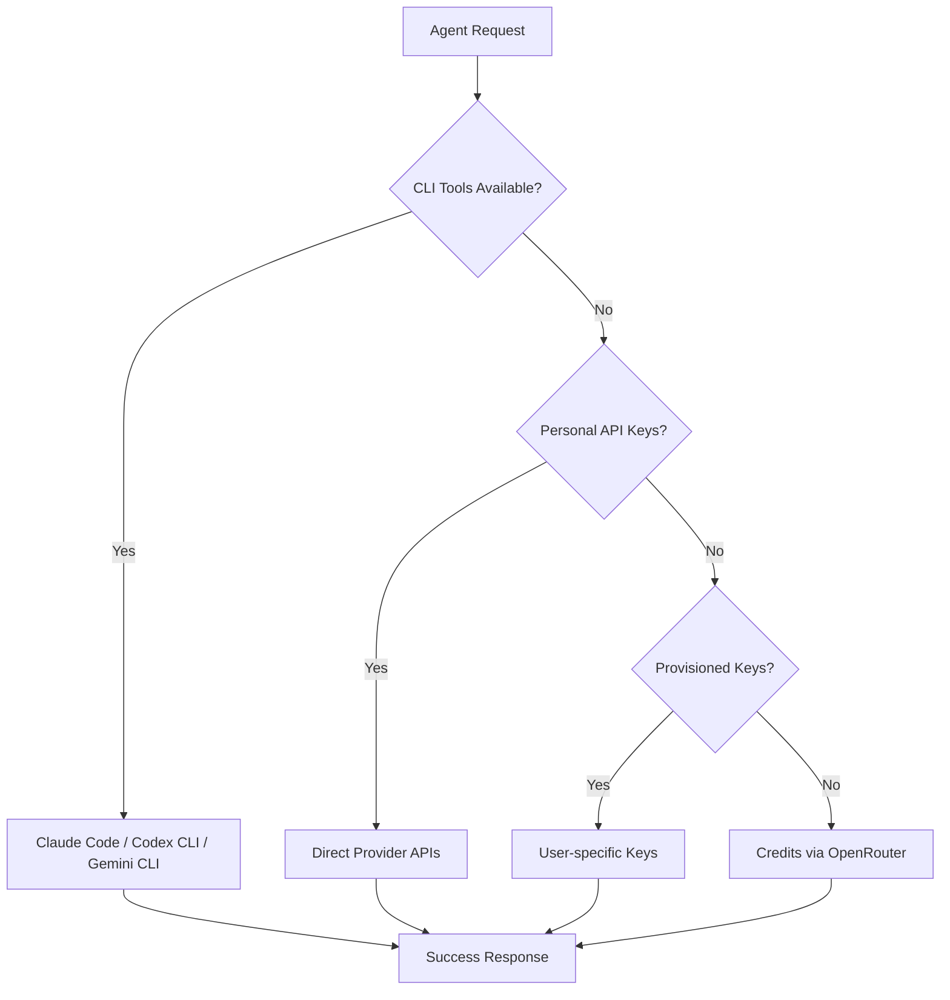

# What is Polydev?

**Polydev is the most advanced Model Context Protocol platform that bridges the gap between AI agents and multiple LLM providers through intelligent fallback systems.**

When your AI agent gets stuck on a complex problem, needs diverse perspectives, or requires access to specialized models, Polydev provides the bridge to overcome these limitations.

## Core Concepts

### Multi-LLM Intelligence
Instead of relying on a single AI model's perspective, Polydev lets your agents consult multiple frontier models simultaneously:

- **GPT-5** for advanced reasoning and code
- **Claude Opus 4** for complex analysis and planning
- **Gemini 2.5 Pro** for very large context windows
- **Grok 4 High** for high‑latency, high‑accuracy reasoning
- Plus 300+ other models across 30+ providers

### Intelligent Fallback System

Polydev implements a sophisticated priority-based routing system that ensures your requests always succeed:



**Priority Order:**
1. **CLI tools** (highest) — use authenticated developer CLIs
2. **Your API keys** — provider keys you control
3. **Credits** (fallback) — Polydev-managed via OpenRouter

### Model Context Protocol Native

Built specifically for MCP (Model Context Protocol) integration:

- **Agent-First Design**: Designed for AI agents, not humans
- **Standardized Interface**: Consistent tool interface across all providers
- **Context Awareness**: Intelligent project memory and context selection
- **Streaming Support**: Real-time response streaming
- **Error Recovery**: Automatic retry and fallback mechanisms

## Key Features

### 🛠️ CLI provider integration
Direct integration with developer tools:
- **Claude Code** (Anthropic)
- **Codex CLI** (OpenAI)
- **Gemini CLI** (Google)

### 🔑 Comprehensive API Key Management
Support for 20+ AI providers with advanced configuration:
- **Encrypted Storage**: Browser-based key encryption
- **Budget Controls**: Monthly spending limits per key
- **Rate Limiting**: Prevent API quota exhaustion
- **Custom Endpoints**: Support for custom deployments
- **Usage Analytics**: Track costs and performance

### 🧠 Smart project memory
TF-IDF-based context selection for better assistance:
- **Light Memory**: Recently modified files
- **Full Memory**: Similarity-based snippet selection
- **Context Budget**: Intelligent token management
- **File Filtering**: Include/exclude patterns

### ⚡ Performance
- **Parallel Queries**: Multiple models queried simultaneously
- **Response Caching**: Intelligent caching of similar requests
- **Connection Pooling**: Efficient API connection management
- **Streaming Responses**: Real-time response delivery

## Use Cases

### 🐛 Debugging Roadblocks
When your agent encounters difficult bugs:

```javascript
const solution = await callTool({
  name: "get_perspectives",
  arguments: {
    prompt: "My React component re-renders excessively despite useMemo. Help identify the real cause and a minimal fix.",
    models: ["gpt-5", "claude-opus-4", "gemini-2.5-pro"],
    project_memory: "full"
  }
});
```

### 🏗️ Architecture Decisions
For complex technical decisions requiring multiple viewpoints:

```javascript
const perspectives = await callTool({
  name: "get_perspectives", 
  arguments: {
    prompt: "Should I use microservices or monolith for this fintech app? I need expert perspectives on trade-offs.",
    models: ["gpt-5", "claude-opus-4", "grok-4-high"]
  }
});
```

### 📝 Code Review & Security
Getting comprehensive code analysis:

```javascript
const review = await callTool({
  name: "polydev.send_cli_prompt",
  arguments: {
    provider_id: "claude_code",
    prompt: "Review this authentication module for security vulnerabilities and suggest improvements.",
    mode: "args"
  }
});
```

## Why Polydev?

### For AI Agents
- **Break Decision Paralysis**: When stuck, get multiple expert perspectives
- **Access Specialized Models**: Use the right model for each task
- **Reliable Fallback**: Never fail due to API issues or rate limits
- **Context Awareness**: Include relevant project context automatically

### For Developers  
- **No Vendor Lock-in**: Use any combination of AI providers
- **Cost Optimization**: Intelligent routing to minimize costs
- **Subscription Leverage**: Use existing CLI subscriptions
- **Advanced Analytics**: Detailed usage and performance metrics

### For Organizations
- **Centralized Management**: Single platform for all AI providers
- **Budget Control**: Granular spending limits and monitoring
- **Security**: Encrypted key storage and secure API handling
- **Scalability**: Handle team and enterprise usage patterns

## Architecture Overview

```
┌─────────────────────────────────────────────────────────┐
│                MCP Client (Agent/IDE)                   │
│              (Claude, Cline, etc.)                      │
└──────────────────────┬──────────────────────────────────┘
                       │ JSON-RPC over stdio
                       ▼
┌─────────────────────────────────────────────────────────┐
│              Polydev MCP Server                         │
│                                                         │
│  ┌─────────────────┐  ┌─────────────────┐             │
│  │ CLI Integration │  │ Perspectives    │             │
│  │                 │  │ Multi-LLM       │             │
│  │ • Claude Code   │  │                 │             │
│  │ • Codex CLI     │  │ • 37+ Models    │             │
│  │ • Gemini CLI    │  │ • 20+ Providers │             │
│  └─────────────────┘  └─────────────────┘             │
│                                                         │
│  ┌─────────────────┐  ┌─────────────────┐             │
│  │ Fallback System │  │ Project Memory  │             │
│  │                 │  │                 │             │
│  │ CLI → API Keys  │  │ • TF-IDF        │             │
│  │ → Provisioned   │  │ • Context       │             │
│  │ → Credits       │  │ • Smart Cache   │             │
│  └─────────────────┘  └─────────────────┘             │
└─────────────────────────────────────────────────────────┘
```

## Next Steps

Ready to get started? Follow our [Quick Start Guide](quick-start.md) to have Polydev running in under 5 minutes.

Or dive deeper into specific areas:
- [Configuration](../config/) - Set up your environment  
- [Providers](../providers/) - Configure AI providers
- [MCP Integration](../mcp/) - Integrate with your agent
- [Features](../features/) - Explore advanced capabilities

---

**Questions?** Check our [troubleshooting guide](../config/troubleshooting.md) or join our [Discord community](https://discord.gg/polydev).
