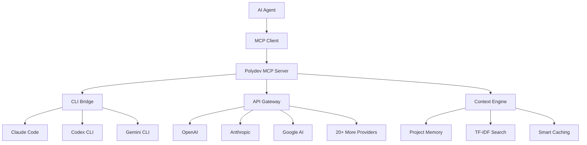

# MCP Overview

Understanding the Model Context Protocol and how Polydev implements it for seamless AI agent integration.

## What is MCP?

The **Model Context Protocol (MCP)** is an open standard that enables AI agents to securely access tools and data sources. Think of it as a universal bridge between AI agents and external services - allowing agents to read files, make API calls, query databases, and more.

### Key Benefits of MCP

- **Standardized Interface**: One protocol for all agent-tool interactions
- **Security First**: Built-in permission management and sandboxing  
- **Tool Discovery**: Automatic detection of available capabilities
- **Cross-Platform**: Works across different agents and environments
- **Extensible**: Easy to add new tools and resources

## How Polydev Uses MCP

Polydev implements MCP to provide AI agents with intelligent access to multiple LLM providers and advanced features:



### Polydev's MCP Implementation

**Core MCP Tools:**
- `get_perspectives` - Multi-LLM responses with intelligent fallback
- `send_cli_prompt` - Direct CLI tool integration
- `search_documentation` - Context-aware documentation search
- `report_cli_status` - Real-time CLI tool monitoring

**Advanced Features:**
- **Project Memory Integration** - Automatic context selection
- **Intelligent Fallback** - CLI → API Keys → Credits routing
- **Performance Analytics** - Usage tracking and optimization
- **Security Layer** - Encrypted key storage and validation

## MCP Architecture

### Client-Server Communication

MCP uses JSON-RPC over stdio for communication:

```typescript
// MCP Request Example
{
  "jsonrpc": "2.0",
  "id": 1,
  "method": "tools/call",
  "params": {
    "name": "get_perspectives",
    "arguments": {
      "prompt": "Explain React hooks",
      "models": ["gpt-4", "claude-3-sonnet"]
    }
  }
}

// MCP Response Example  
{
  "jsonrpc": "2.0",
  "id": 1,
  "result": {
    "content": [
      {
        "type": "text", 
        "text": "Here are perspectives from multiple models..."
      }
    ]
  }
}
```

### Tool Discovery

Agents automatically discover available tools:

```json
{
  "tools": [
    {
      "name": "get_perspectives",
      "description": "Get diverse perspectives from multiple AI models",
      "inputSchema": {
        "type": "object",
        "properties": {
          "prompt": { "type": "string" },
          "models": { "type": "array", "items": { "type": "string" } }
        },
        "required": ["prompt"]
      }
    }
  ]
}
```

### Resource Management

MCP handles file access and caching:

```json
{
  "resources": [
    {
      "uri": "file:///path/to/project/src/app.js",
      "name": "Application Entry Point",
      "description": "Main application file",
      "mimeType": "application/javascript"
    }
  ]
}
```

## Supported MCP Clients

### Claude Desktop (Recommended)

Official Claude desktop app with built-in MCP support:

```json
// ~/Library/Application\ Support/Claude/claude_desktop_config.json
{
  "mcpServers": {
    "polydev": {
      "command": "node",
      "args": ["/path/to/polydev/mcp/server.js"],
      "env": {
        "POLYDEV_CLI_DEBUG": "1"
      }
    }
  }
}
```

### Cline (VS Code Extension)

Popular VS Code extension for AI coding assistance:

```json
// VS Code Settings
{
  "cline.mcpServers": {
    "polydev": {
      "command": "node",
      "args": ["/path/to/polydev/mcp/server.js"]
    }
  }
}
```

### Custom MCP Clients

Build your own MCP client:

```typescript
import { MCPClient } from '@modelcontextprotocol/client';

const client = new MCPClient({
  command: 'node',
  args: ['/path/to/polydev/mcp/server.js']
});

await client.connect();

const result = await client.callTool({
  name: 'get_perspectives',
  arguments: {
    prompt: 'Help me debug this React component',
    models: ['claude-3-sonnet', 'gpt-4']
  }
});
```

## MCP Security Model

### Permission System

MCP implements granular permissions:

```json
{
  "permissions": {
    "tools": {
      "get_perspectives": "allow",
      "send_cli_prompt": "prompt"  // Requires user confirmation
    },
    "resources": {
      "file:///path/to/project/**": "read-only",
      "file:///sensitive/**": "deny"
    }
  }
}
```

### Sandboxing

Tools run in isolated environments:

- **Process Isolation**: CLI commands in separate processes
- **File System Limits**: Restricted file access permissions
- **Network Controls**: Configurable external access
- **Resource Limits**: Memory and CPU restrictions

### Data Privacy

- **Local Processing**: Sensitive data stays local when using CLI providers
- **Encrypted Storage**: API keys encrypted client-side
- **Audit Logging**: Complete request/response logging
- **User Consent**: Explicit permission for tool usage

## Getting Started with MCP

### 1. Install MCP Server

```bash
# Clone Polydev repository
git clone https://github.com/polydev-ai/polydev.git
cd polydev

# Install dependencies
npm install

# Start MCP server
npm run mcp:server
```

### 2. Configure Your Agent

Choose your preferred MCP client and add Polydev configuration:

**Claude Desktop:** Edit `claude_desktop_config.json`
**Cline:** Configure in VS Code settings
**Custom Client:** Use MCP SDK to connect

### 3. Test Integration

```javascript
// Test basic MCP connectivity
const response = await client.callTool({
  name: 'get_perspectives',
  arguments: {
    prompt: 'Hello, MCP!',
    models: ['gpt-3.5-turbo']
  }
});

console.log(response.content);
```

### 4. Explore Advanced Features

- **Multi-Provider Fallback**: Automatic provider switching
- **Project Memory**: Context-aware assistance
- **CLI Integration**: Leverage existing subscriptions
- **Analytics**: Track usage and performance

## MCP Best Practices

### Tool Usage Patterns

**Single Model Requests:**
```javascript
// For specific model requirements
await client.callTool({
  name: 'send_cli_prompt',
  arguments: {
    provider_id: 'claude_code',
    prompt: 'Code-specific task requiring Claude expertise'
  }
});
```

**Multi-Model Perspectives:**
```javascript
// For complex decisions requiring multiple viewpoints
await client.callTool({
  name: 'get_perspectives', 
  arguments: {
    prompt: 'Architecture decision needing diverse expert opinions',
    models: ['gpt-4', 'claude-3-opus', 'gemini-pro']
  }
});
```

**Context-Aware Requests:**
```javascript
// For project-specific assistance
await client.callTool({
  name: 'get_perspectives',
  arguments: {
    prompt: 'Review my authentication implementation',
    project_memory: 'full',
    project_context: {
      root_path: '/path/to/project'
    }
  }
});
```

### Error Handling

```javascript
try {
  const result = await client.callTool({
    name: 'get_perspectives',
    arguments: { prompt: 'Test request' }
  });
} catch (error) {
  if (error.code === 'PROVIDER_UNAVAILABLE') {
    // Handle provider fallback
    console.log('Primary provider failed, trying fallback...');
  } else if (error.code === 'RATE_LIMIT_EXCEEDED') {
    // Handle rate limiting
    console.log('Rate limit hit, waiting before retry...');
  }
}
```

### Performance Optimization

```javascript
// Optimize for speed with fast models
const quickResponse = await client.callTool({
  name: 'get_perspectives',
  arguments: {
    prompt: 'Quick question needing fast response',
    models: ['gpt-3.5-turbo', 'claude-3-haiku'],
    provider_settings: {
      temperature: 0.3,
      max_tokens: 500
    }
  }
});
```

## Debugging MCP Integration

### Enable Debug Mode

```bash
# Enable comprehensive MCP debugging
export POLYDEV_CLI_DEBUG=1
export POLYDEV_DEBUG=1
export MCP_DEBUG=1

npm run mcp:server
```

### Check MCP Server Status

```bash
# Test MCP server health
curl -X POST http://localhost:3000/api/mcp/health

# List available tools
curl -X POST http://localhost:3000/api/mcp/tools

# Check provider status
npm run test:providers
```

### Common Debug Commands

```bash
# Test CLI detection
npm run test:cli

# Validate configuration
npm run validate:config

# Check resource access
npm run test:resources

# Monitor performance
npm run monitor:mcp
```

## Next Steps

Ready to integrate Polydev with your agent? Choose your path:

### Quick Setup
1. **[Server Setup](server-setup.md)** - Install and configure MCP server
2. **[Agent Integration](agents/)** - Connect with your preferred agent
3. **[Test Integration](tools/)** - Verify everything works

### Advanced Configuration
1. **[Custom Tools](tools/custom-tools.md)** - Build custom MCP tools
2. **[Security Configuration](security.md)** - Configure permissions and access
3. **[Performance Tuning](performance.md)** - Optimize for your use case

### Development
1. **[MCP SDK](development/sdk.md)** - Build custom MCP clients
2. **[Protocol Extensions](development/extensions.md)** - Extend MCP capabilities
3. **[Contributing](../development/contributing.md)** - Contribute to Polydev MCP

---

**Questions about MCP integration?** Check our [troubleshooting guide](../config/troubleshooting.md) or join our [Discord](https://discord.gg/polydev).