# AI Providers

Polydev supports 20+ AI providers with intelligent fallback routing to ensure your requests always succeed.

## Overview

Polydev's provider ecosystem gives you access to the best AI models through multiple access methods, automatically routing requests based on availability and your preferences.

## Provider Categories

### 🖥️ CLI Providers (Highest Priority)
Use your existing developer CLI subscriptions - no API key management needed.

- **[Claude Code](cli-providers/claude-code.md)** - Official Anthropic CLI with Claude Pro subscription
- **[Codex CLI](cli-providers/codex-cli.md)** - OpenAI's developer interface for ChatGPT Plus users
- **[Gemini CLI](cli-providers/gemini-cli.md)** - Google's AI development toolkit

### 🔑 API Providers (Second Priority)
Direct API access with your personal keys for maximum control.

#### Major Providers
- **[OpenAI](api-providers/openai.md)** - GPT-4, GPT-3.5-Turbo, and specialized models
- **[Anthropic](api-providers/anthropic.md)** - Claude 3 family (Opus, Sonnet, Haiku)
- **[Google AI](api-providers/google-ai.md)** - Gemini Pro, Gemini Flash, and PaLM models
- **[Groq](api-providers/groq.md)** - Ultra-fast inference for Llama and Mixtral models

#### High-Performance Providers
- **[Perplexity](api-providers/perplexity.md)** - Research-focused models with real-time information
- **[Cohere](api-providers/cohere.md)** - Command models for business applications
- **[Mistral AI](api-providers/mistral.md)** - Mistral 7B, Mixtral 8x7B, and specialized models
- **[Together AI](api-providers/together.md)** - Open-source model hosting platform

#### Specialized Providers
- **[Replicate](api-providers/replicate.md)** - Image generation and specialized AI models
- **[Hugging Face](api-providers/hugging-face.md)** - Open-source model inference
- **[AI21 Labs](api-providers/ai21.md)** - Jurassic models for text generation
- **[Fireworks AI](api-providers/fireworks.md)** - Fast inference for open-source models

### 🔄 Aggregation Providers (Fallback)
Single API access to multiple providers for seamless fallback.

- **[OpenRouter](api-providers/openrouter.md)** - 100+ models from 20+ providers
- **[Anyscale](api-providers/anyscale.md)** - Open-source model endpoints
- **[DeepInfra](api-providers/deepinfra.md)** - Cost-effective model inference

## Intelligent Fallback System

Polydev automatically routes requests through providers in priority order:

```mermaid
flowchart TD
    A[AI Request] --> B{CLI Tools Available?}
    B -->|Yes| C[🖥️ Claude Code / Codex CLI / Gemini CLI]
    B -->|No| D{Personal API Keys?}
    D -->|Yes| E[🔑 OpenAI / Anthropic / Google / Others]
    D -->|No| F{Provisioned Keys?}
    F -->|Yes| G[📊 User-specific Managed Keys]
    F -->|No| H[💳 Credits via OpenRouter]
    
    C --> I[✅ Response Delivered]
    E --> I
    G --> I
    H --> I
    
    C -->|Failed| D
    E -->|Failed| F
    G -->|Failed| H
```



### Priority Levels

1. **🥇 CLI Tools** - Use authenticated developer subscriptions
2. **🥈 Personal API Keys** - Your configured provider keys
3. **🥉 Provisioned Keys** - Managed keys for your account
4. **🏅 Credits System** - Pay-per-use fallback via OpenRouter

## Model Mapping

Polydev automatically maps model IDs across providers:

| Universal ID | OpenAI | Anthropic | Google | Groq |
|--------------|---------|-----------|--------|------|
| `gpt-4` | `gpt-4` | N/A | N/A | N/A |
| `claude-3-sonnet` | N/A | `claude-3-5-sonnet-20241022` | N/A | N/A |
| `gemini-pro` | N/A | N/A | `gemini-1.5-pro-latest` | N/A |
| `llama-3.1-70b` | N/A | N/A | N/A | `llama-3.1-70b-versatile` |

## Provider Configuration

### Quick Setup

1. **Choose Your Method:**
   - CLI Tools: Install and authenticate CLI providers
   - API Keys: Add provider keys in dashboard
   - Credits: Generate MCP token for managed access

2. **Configure Fallback:**
   ```bash
   # Set preferred provider order
   POLYDEV_PREFERRED_PROVIDERS=claude_code,openai,anthropic,groq
   
   # Set fallback models
   POLYDEV_FALLBACK_MODELS=gpt-3.5-turbo,claude-3-haiku
   ```

3. **Test Configuration:**
   ```javascript
   const result = await callTool({
     name: "get_perspectives",
     arguments: {
       prompt: "Test multi-provider setup",
       models: ["gpt-4", "claude-3-sonnet", "gemini-pro"]
     }
   });
   ```

### Advanced Configuration

#### Rate Limiting
```bash
# Per-provider rate limits (requests per minute)
RATE_LIMIT_RPM_OPENAI=60
RATE_LIMIT_RPM_ANTHROPIC=50
RATE_LIMIT_RPM_GOOGLE=100
RATE_LIMIT_RPM_GROQ=200
```

#### Budget Controls
```bash
# Monthly spending limits (USD)
BUDGET_LIMIT_OPENAI=100
BUDGET_LIMIT_ANTHROPIC=75
BUDGET_LIMIT_GOOGLE=50
```

#### Custom Endpoints
```bash
# Custom OpenAI-compatible endpoints
CUSTOM_OPENAI_ENDPOINT=https://your-endpoint.com/v1
CUSTOM_OPENAI_API_KEY=your-api-key
```

## Provider Comparison

### Performance Comparison

| Provider | Avg Latency | Throughput | Cost/1K Tokens | Reliability |
|----------|-------------|------------|-----------------|-------------|
| Claude Code CLI | ~2s | High | $0* (subscription) | 99.5% |
| OpenAI API | ~1.5s | High | $0.03-0.06 | 99.9% |
| Groq | ~0.3s | Ultra High | $0.27-0.59 | 99.0% |
| Google AI | ~2s | Medium | $0.125-0.50 | 99.2% |
| Perplexity | ~3s | Medium | $1.00-5.00 | 98.5% |

*Requires active subscription

### Model Capabilities

| Provider | Context Window | Multimodal | Function Calling | Streaming |
|----------|----------------|------------|------------------|-----------|
| OpenAI | 128K | ✅ Images | ✅ | ✅ |
| Anthropic | 200K | ✅ Images | ✅ | ✅ |
| Google AI | 2M | ✅ Images, Audio | ✅ | ✅ |
| Groq | 32K | ❌ | ✅ | ✅ |
| Perplexity | 16K | ❌ | ❌ | ✅ |

### Use Case Recommendations

**🧠 Complex Reasoning:** Claude 3 Opus, GPT-4
**⚡ Fast Responses:** Groq Llama 3.1, Groq Mixtral
**💰 Cost-Effective:** Claude 3 Haiku, GPT-3.5-Turbo
**🔍 Research & Analysis:** Perplexity Sonar, Claude 3 Opus
**💻 Code Generation:** Claude 3.5 Sonnet, GPT-4, Codestral
**🎨 Creative Writing:** Claude 3 Opus, GPT-4
**📊 Data Analysis:** GPT-4, Gemini Pro

## Getting Started

### Option 1: CLI Provider Setup (Recommended)

```bash
# Install Claude Code (requires Claude Pro)
npm install -g @anthropic-ai/claude-code
claude auth login

# Test integration
npm run test:cli
```

### Option 2: API Key Setup

1. Get API keys from preferred providers
2. Add them in the dashboard: Settings → API Keys
3. Configure budgets and rate limits
4. Test with multi-model request

### Option 3: Credits System

1. Generate MCP token at [polydev.ai/dashboard/mcp-tools](https://polydev.ai/dashboard/mcp-tools)
2. Configure MCP client with token
3. Start making requests with managed keys

## Provider-Specific Guides

### CLI Providers
- [Claude Code Setup](cli-providers/claude-code.md)
- [Codex CLI Configuration](cli-providers/codex-cli.md)  
- [Gemini CLI Integration](cli-providers/gemini-cli.md)

### Major API Providers
- [OpenAI Configuration](api-providers/openai.md)
- [Anthropic Setup](api-providers/anthropic.md)
- [Google AI Integration](api-providers/google-ai.md)
- [Groq Configuration](api-providers/groq.md)

### Specialized Providers
- [Perplexity Setup](api-providers/perplexity.md)
- [OpenRouter Integration](api-providers/openrouter.md)
- [Custom Provider Configuration](custom-providers.md)

## Troubleshooting

### Common Issues

**CLI not detected:**
```bash
# Check PATH and authentication
which claude
claude auth status
```

**API key errors:**
```bash
# Test API key directly
curl -H "Authorization: Bearer $OPENAI_API_KEY" \
     https://api.openai.com/v1/models
```

**Rate limit exceeded:**
```bash
# Adjust rate limits
RATE_LIMIT_RPM_OPENAI=30  # Reduce from default
```

**Model not found:**
```bash
# Check available models
npm run models:list
```

## Next Steps

Once providers are configured:

1. **[MCP Integration](../mcp/)** - Connect with your AI agent
2. **[Multi-LLM Perspectives](../features/perspectives/)** - Get diverse AI perspectives  
3. **[Analytics](../features/analytics.md)** - Monitor usage and performance
4. **[Troubleshooting](../config/troubleshooting.md)** - Resolve common issues

---

**Questions about providers?** Check our [troubleshooting guide](../config/troubleshooting.md) or join our [Discord](https://discord.gg/polydev).